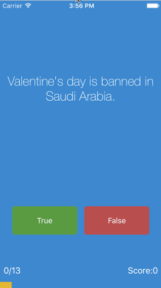

#  Quizzler

## Outline

This app makes me learn about Model View Controller (MVC) pattern. A design pattern is simply a repeatable and optimised solution to a common software problem

## What is Quizzler

This is trivia quiz app, inspired by the awesome “Quiz Up” game. In this app, we are remaking one of the multiple choice question apps that are one of the most popular types of educational apps on the App Store.

## What I've learnt

* What is a design pattern and how is it used in programming.
* How to use the Model-View-Controller or MVC pattern for app development.
* Object Oriented Programming.
* How to store data locally.
* How to incorporate third party libraries and how to display Heads Up Displays (HUDs).
* How to refactor code and stay organised.
* Learn about class initialisation.
* How to programmatically change UI elements such as Labels and Views.
* Start thinking about data encapsulation and how to keep data safe from corruption.

## Demo

